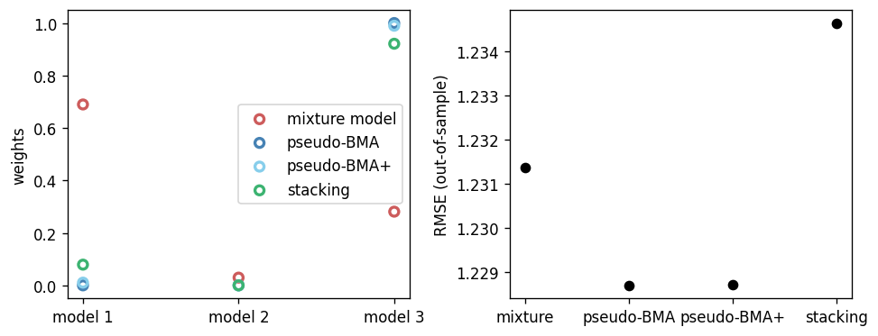

# Model averaging via mixture modeling, pseudo-BMA, pseudo-BMA+ and stacking

To build intuition about model averaging methods,
this tutorial compares [mixture modeling](
https://en.wikipedia.org/wiki/Mixture_model
) to different model averaging approaches 
possible in BayesBlend: pseudo-BMA, pseudo-BMA+,
maximum-likelihood stacking and 
Bayesian stacking. BayesBlend is the only
software we're aware of that offers stacking using 
full Bayesian inference out-of-the-box.

Most model averaging methods are closely related to mixture
modelling. Traditional [Bayesian model averaging](
https://en.wikipedia.org/wiki/Ensemble_learning#Bayesian_model_averaging
) (BMA), for instance,
averages models, $\mathcal{M} = \{M_{1}, ..., M_{K}\}$,
based on their posterior model probabilities,
$p(M_{k} \mid y) = \frac{p(y \mid M_{k}) p(M_{k})}{\sum_{k = 1}^{K} p(y \mid M_{k}) p(M_{k})}$, 
where the posterior model probabilities are commonly
calculated as a function of the marginal likelihood,
$\int p(y \mid \theta, M_k) p(\theta_k \mid M_k) p(\theta_k) d\theta_k$,
and user-defined prior model probabilities, $P(M_k \mid y)$
([Hoeting *et al.*, 1999](file:///Users/cmgoold/Downloads/1009212519.pdf),
[Hinne *et al*., 2020](https://journals.sagepub.com/doi/full/10.1177/2515245919898657?trk=public_post_comment-text#appendix)
). However, the posterior model weights can also be
estimated directly by making $M_k$ a parameter
of a mixture model
([Kruschke, 2011](https://citeseerx.ist.psu.edu/document?repid=rep1&type=pdf&doi=36edd08030b28d7b549e7c39c630e051e231bd98),
[Keller & Kamary, 2017](https://arxiv.org/abs/1711.10016)).
Notice that the mixture modelling/BMA approach
allocates posterior weight to models only within
the space of candidate models, as is the process
of Bayesian updating.
This makes most sense when the true model can be conceived
as one of the candidate models, a problem
that is referred to as $\mathcal{M}$-closed.

Model averaging approaches implemented in BayesBlend and elsewhere,
however, differ from the mixture modelling approach by splitting
the problem into two separate steps: one to estimate the quantity
of interest from each candidate model, and another to
estimate the model weights and blend predictions.
In the first step, it is common to use cross-validation
to obtain estimates of candidate model predictive performance
that generalizes to data not seen in the training set,
effectively opening up the set of candidate models being
compared. This is partciularly powerful in $\mathcal{M}$-open
problems, where the true model is not one of the candidate
models because the true model is unknown, intractable
or too complex to reify
([Yao *et al.*, 2018](
http://www.stat.columbia.edu/~gelman/research/published/stacking_paper_discussion_rejoinder.pdf
)).
Two-step model averaging methods have the
additional benefits of being
computationally faster and less prone to
estimation errors. 

## Simulation example 

In this example,
we simulate univariate data of 
size $N = 50$ from the following
model:

\begin{align}
    \tag{True model}
    \mathbf{y}_{1:N} &\sim \mathrm{Normal}(\alpha, 1)\\
    (\mathbf{x}_1, \mathbf{x}_2)' &\sim \mathrm{Normal}(0, 1)\\
    \alpha &\sim \mathrm{Normal}(0, 1)\\
\end{align}

as well as $\tilde{N} = 50$ test data from the same model.

We then use three candidate models that each 
incorrectly presume that the variables $\mathbf{x}_1$
and $\mathbf{x}_2$ are linearly related to the
response, $\mathbf{y}$.

Model 1 includes a single predictor $\mathbf{x}_{1} = (x_{11}, x_{21}, ..., x_{i1}, ..., x_{N1})$:

\begin{align}
    \tag{Model 1}
    y_{i} &\sim \mathrm{Normal}(\mu_{i}, 1)\\
    \mu_{i} &= \alpha + \beta x_{i1}\\
    \alpha &\sim \mathrm{Normal}(0, 1)\\
    \beta &\sim \mathrm{Normal}(0, 1)\\
\end{align}

Model 2 includes a single predictor $\mathbf{x}_{2}$:

\begin{align}
    \tag{Model 2}
    y_{i} &\sim \mathrm{Normal}(\mu_{i}, 1)\\
    \mu_{i} &= \alpha + \beta x_{i2}\\
    \alpha &\sim \mathrm{Normal}(0, 1)\\
    \beta &\sim \mathrm{Normal}(0, 1)\\
\end{align}

Model 3 includes both predictors but not their interaction:

\begin{align}
    \tag{Model 3}
    y_{i} &\sim \mathrm{Normal}(\mu_{i}, 1)\\
    \mu_{i} &= \alpha + \beta_{1} x_{i1} + \beta_{2} x_{i2}\\
    \alpha &\sim \mathrm{Normal}(0, 1)\\
    (\beta_1, \beta_2)' &\sim \mathrm{Normal}(0, 1)\\
\end{align}

The mixture model fits all three models simultaneously,
estimating the simplex of model probabilities, 
$\mathbf{w} = (w_1, w_2, w_3)$,
with a uniform Dirichlet prior.

\begin{align}
    \tag{Mixture}
    y_{i} &\sim \mathrm{Normal}(\mu_{k}, 1)\\
    k &\sim \mathrm{Categorical(\mathbf{w})}\\
    \mathbf{w}_{1:K} &\sim \mathrm{Dirichlet}( (1, 1, 1)')\\
\end{align}

In practice, the categorical parameter, $k$, is marginalized 
out of the likelihood expression:

\begin{align}
    p(y_{i}) &= \sum_{k=1}^{K} w_{k} \cdot \mathrm{Normal}(\mu_{k}, 1)\\
    \mathbf{w}_{1:K} &\sim \mathrm{Dirichlet}( (1, 1, 1)')\\
\end{align}

We simulate $S = 100$ data sets of training and test data
and then, for each simulation $s$, we:

1. Fit the mixture model and evaluate the log predictive densities of `y_tilde`
from each mixture component, 
which we denote as $\log{p(\tilde{y} \mid M_{k})}$.
2. Fit the independent regression models and evaluate both $\log{p(y \mid M_{k})}$ and 
$\log{p(\tilde{y} \mid M_{k})}$.
3. Estimate the Pareto-smoothed importance sampling (PSIS) leave-one-out (LOO) cross-validation predictive
densities of $\log{p(y \mid M_{k})}$.
3. Fit the pseudo-BMA, pseudo-BMA+, stacking-mle (using maximum-likelihood optimization)
and stacking-bayes (using full Bayesian inference) to the PSIS-LOO log densities from step
3 to estimate the optimal weights for blending. 
4. Blend $\log{p(\tilde{y} \mid M_{k})}$ according to the weights from the mixture model
and those estimated in step 3. We always take the expectation of the weights in cases
where we have a posterior of $p(M_k \mid y)$.
5. Calculate the [ELPD](https://stat.columbia.edu/~gelman/research/unpublished/loo_stan.pdf)
from the blended out-of-sample log densities to compare the models.

Below, we show the main parts of our workflow and the results. To reproduce the full
workflow, the code can be found [here](
https://github.com/LedgerInvesting/bayesblend/blob/main/docs/user-guide/scripts/simulation.py
).

## Simulating the data 

We simulate data using the function below,
which returns the tuple of training data
(`y, X`) and test data (`y_tilde`, `X_tilde`).


```python title="Data simulation"
from typing import Optional, Tuple
import arviz as az
import numpy as np
import cmdstanpy as csp

import bayesblend as bb

Data = Tuple[np.ndarray, np.ndarray]

SEED = 1234
K = 3
P = 2
N = 50
N_tilde = 50
rng = np.random.default_rng(SEED)

def simulate_data(seed: Optional[int] = None) -> Tuple[Data, Data]:
    alpha = rng.normal()
    sigma = 1
    X = rng.normal(size=(N, P))
    X_tilde = rng.normal(size=(N_tilde, P))
    y = rng.normal(alpha, sigma, size=N)
    y_tilde = rng.normal(alpha, sigma, size=N_tilde)

    return ((y, X), (y_tilde, X_tilde))
```

## Mixture model

We can use Stan to fit the implied mixture model between candidate models.
In the generated quantities section, we evaluate the log predictive
densities on `y_tilde` from each model separately, $\log{p(\tilde{y} \mid M_{k})}$,
not accounting for the weights at this time. The weights are applied using
BayesBlend later.

```stan title="mixture.stan"
data {
    int<lower=0> N;
    int<lower=0> N_tilde;
    int<lower=2> K;
    int<lower=1> P;
    matrix[N, P] X;
    matrix[N_tilde, P] X_tilde;
    vector[N] y;
    vector[N_tilde] y_tilde;
}

parameters {
    vector[K] alpha;
    vector[P + 2] beta;
    simplex[K] w;
}

transformed parameters {
    matrix[N, K] lps;

    for(i in 1:N) {
        lps[i] = [
            log(w[1]) + normal_lpdf(y[i] | alpha[1] + beta[1] * X[i,1], 1),
            log(w[2]) + normal_lpdf(y[i] | alpha[2] + beta[2] * X[i,2], 1),
            log(w[3]) + normal_lpdf(y[i] | alpha[3] + X[i] * beta[3:], 1)
        ];
    }
}

model {
    alpha ~ std_normal();
    beta ~ std_normal();

    for(i in 1:N)
        target += log_sum_exp(lps[i]);
}

generated quantities {
    matrix[N_tilde, K] log_lik;

    for(j in 1:N_tilde) {
        log_lik[j] = [
            normal_lpdf(y_tilde[j] | alpha[1] + beta[1] * X_tilde[j,1], 1),
            normal_lpdf(y_tilde[j] | alpha[2] + beta[2] * X_tilde[j,2], 1),
            normal_lpdf(y_tilde[j] | alpha[3] + X_tilde[j] * beta[3:], 1)
        ];
    }
}
```

This mixture can be fit with the function below:

```python title="Fit the mixture model"
def fit_mixture(train, test):
    mixture = csp.CmdStanModel(stan_file="mixture.stan")
    y, X = train
    y_tilde, X_tilde = test
    fit = mixture.sample(
        data={
            "N": len(y),
            "N_tilde": len(y_tilde),
            "P": P,
            "K": K,
            "X": X[:, :P],
            "X_tilde": X_tilde[:, :P],
            "y": y,
            "y_tilde": y_tilde,
        },
        inits=0,
        seed=SEED,
    )
    return fit
```

## Regression models

The regression models are all fit in Stan using the following
model.
In the `generated quantities` section,
we evaluate the log predictive densities on both the in-sample
and out-of-sample data. The in-sample log-densities are later used
later to estimate the weights. In the mixture model above,
the weights are estimated as part of the model.

```stan title="regression.stan"
data {
    int<lower=0> N;
    int<lower=0> N_tilde;
    int<lower=1> P;
    matrix[N, P] X;
    matrix[N_tilde, P] X_tilde;
    vector[N] y;
    vector[N_tilde] y_tilde;
}

parameters {
    real alpha;
    vector[P] beta;
}

transformed parameters {
    vector[N] mu = alpha + X * beta;
}

model {
    alpha ~ std_normal();
    beta ~ std_normal();
    y ~ normal(mu, 1);
}

generated quantities {
    vector[N] log_lik;
    vector[N_tilde] log_lik_tilde;
    
    for(i in 1:N) 
        log_lik[i] = normal_lpdf(y[i] | mu[i], 1);
    
    for(j in 1:N_tilde) {
        real mu_tilde = alpha + X_tilde[j] * beta;
        log_lik_tilde[j] = normal_lpdf(y_tilde[j] | mu_tilde, 1);
    }
}
```

Again, the regressions can be fit with the following function:

```python title="Fit the regressions"
def fit_regressions(train, test):
    y, X = train
    y_tilde, X_tilde = test
    predictors = [(X[:, [*p]], X_tilde[:, [*p]]) for p in ([0], [1], [0, 1])]
    fits = [
        regression.sample(
            data={
                "N": N,
                "N_tilde": N_tilde,
                "P": x.shape[1],
                "X": x,
                "X_tilde": x_tilde,
                "y": y,
                "y_tilde": y_tilde,
            },
            seed=SEED,
        )
        for (x, x_tilde) in predictors
    ]
    return fits
```

## Estimating the weights and blending

For the regression models, we estimate the
PSIS-LOO log densities, as recommended
by
[Yao *et al.* (2018)](
http://www.stat.columbia.edu/~gelman/research/published/stacking_paper_discussion_rejoinder.pdf
), using `arviz`.


```python
regressions = fit_regressions(train, test)

idata = [az.from_cmdstanpy(fit) for fit in regressions]
loo_i = [az.loo(i).loo_i.values for i in idata]
```

Next, we apply our blending models using BayesBlend.
For the mixture model, we use the `SimpleBlend`
model to blend the results using the previously-estimated
weights.

```python title="Blend"
# The out-of-sample log likelihood draws 
# to blend for the regressions
pred_draws = {
    f"fit{i}": bb.Draws(
        log_lik=fit.log_lik_tilde,
    )
    for i, fit in enumerate(regressions)
}

# Mixture model blend
mix = bb.SimpleBlend(
    {f"fit{i}": bb.Draws(log_lik=mixture.log_lik[..., i]) for i in range(K)},
    weights={f"fit{i}": w for i, w in enumerate(mixture.w.T)},
)
mix_blend = mix.predict()

# Pseudo-BMA
pbma = bb.PseudoBma.from_lpd(
    loo_fits,
    bootstrap=False,
)
pbma.fit()
pbma_blend = pbma.predict(pred_draws)

# Pseudo-BMA+
pbma_plus = bb.PseudoBma.from_lpd(loo_fits, seed=SEED)
pbma_plus.fit()
pbma_plus_blend = pbma_plus.predict(pred_draws)

# Stacking (mle)
stack = bb.MleStacking.from_lpd(loo_fits)
stack.fit()
stack_blend = stack.predict(pred_draws)

# Stacking (bayes)
stack_bayes = bb.BayesStacking.from_lpd(loo_fits, seed=SEED)
stack_bayes.fit()
stack_bayes_blend = stack_bayes.predict(pred_draws)
```

## Evaluate the predictions

To evaluate the ELPD for each blend,
we can simply call `Draws.lpd.sum()`
on each model.

Below is the comparison plot for the models.
The top panel shows the mean ELPDs for each model
(blue points) with their 95% percentile intervals
(vertical lines). The gray open circles are all
the ELPDs from each model.

The second panel shows the mean and 95% percentile
intervals of the estimated weights
from each model.



As the ELPD values show, the BayesBlend model avergaing
methods all perform better than the mixture modelling
approach for this example, indicating that the
use of PSIS-LOO estimates to obtain the model
weights offers a non-trivial performance
improvement. The differences between
pseudo-BMA, pseudo-BMA+, stacking-mle
and stacking-bayes are very small for this
example, although this might not always be
the case
([see Yao *et al.*, 2018](
http://www.stat.columbia.edu/~gelman/research/published/stacking_paper_discussion_rejoinder.pdf
)).

The estimated weights across methods
mostly weight models 1 and 2 equally,
and model 3 the least plausible. Notice
that the stacking-mle model has much wider
percentile intervals because it often
places most weight on either model 1 or model 2
rather than dividing weight equally,
which is expected from a pure optimization
process if models 1 and 2 provide similar predictions.
The Bayesian stacking implementation (stacking-bayes)
places a prior over the weights, however, which means
its weights are much more uniform between models than
its MLE counterpart.
