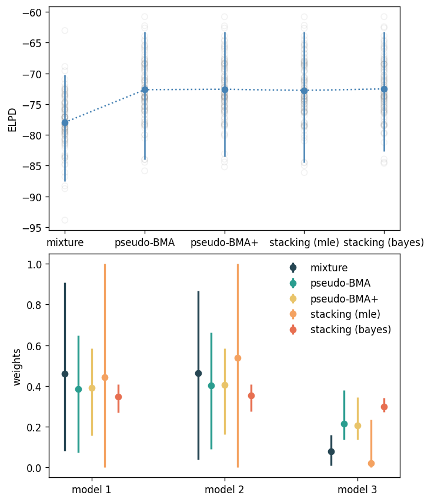

# Model averaging via mixture modeling, pseudo-BMA, pseudo-BMA+ and stacking

To build intuition about model averaging methods,
this tutorial compares [mixture modeling](
https://en.wikipedia.org/wiki/Mixture_model
) to different model averaging approaches 
possible in BayesBlend: pseudo-BMA, pseudo-BMA+,
and maximum-likelihood stacking and 
Bayesian stacking.

Most model averaging methods are closely related to mixture
modelling, but differ in that they're often applied
in two separate steps: one to estimate the quantity
of interest from each candidate model, and another to
estimate the model weights and blend predictions.
In practice, model averaging methods, like stacking,
are usually quicker and less prone to
estimation errors ([Yao *et al.*, 2018](
http://www.stat.columbia.edu/~gelman/research/published/stacking_paper_discussion_rejoinder.pdf
)),
and may perform better than mixture modelling
because the quantities used to compare models
focus on out-of-sample predictive accuracy, not just
in-sample performance.
This is particularly the case in $\mathcal{M}$-open settings,
where the true model is not in the set of
candidate models $\mathcal{M} = \{M_{1}, ..., M_{K}\}$
because it is unknown, intractable or otherwise too complex
to specify.

Mixture modelling has also been found to be 
similar to the traditional technique of
[Bayesian model averaging](
https://arxiv.org/abs/1711.10016
), as the expectation of the 
posterior distribution of the mixture weights
approximates the marginal model likelihoods.
However, see [Yao *et al.* (2018)](
http://www.stat.columbia.edu/~gelman/research/published/stacking_paper_discussion_rejoinder.pdf
) for discussion of their potential differences.

In this example,
we simulate univariate data of size $N = 50$ from a
normal distribution:

\begin{align}
    \tag{True model}
    \mathbf{y}_{1:N} &\sim \mathrm{Normal}(\alpha, \sigma)\\
    \alpha &\sim \mathrm{Normal}(0, 1)\\
\end{align}

We then use three candidate models that each correctly are similar to the true model
but do not specify the correct linear predictor term, $\mu_{i}$. 
Each model uses weakly informative priors.

Model 1 includes a single predictor $\mathbf{x}_{1} = (x_{11}, x_{21}, ..., x_{i1}, ..., x_{N1})$:

\begin{align}
    \tag{Model 1}
    y_{i} &\sim \mathrm{Normal}(\mu_{i}, \sigma)\\
    \mu_{i} &= \alpha + \beta x_{i1}\\
    \alpha &\sim \mathrm{Normal}(0, 1)\\
    \beta &\sim \text{Student-t}_{3}(0, 1)\\
    \sigma &\sim \text{Student-t}_{3}(0, 1)\\
\end{align}

Model 2 includes a single predictor $\mathbf{x}_{2}$:

\begin{align}
    \tag{Model 2}
    y_{i} &\sim \mathrm{Normal}(\mu_{i}, \sigma)\\
    \mu_{i} &= \alpha + \beta x_{i2}\\
    \alpha &\sim \mathrm{Normal}(0, 1)\\
    \beta &\sim \text{Student-t}_{3}(0, 1)\\
    \sigma &\sim \text{Student-t}_{3}(0, 1)\\
\end{align}

Model 3 includes both predictors but not their interaction:

\begin{align}
    \tag{Model 3}
    y_{i} &\sim \mathrm{Normal}(\mu_{i}, \sigma)\\
    \mu_{i} &= \alpha + \beta_{1} x_{i1} + \beta_{2} x_{i2}\\
    \alpha &\sim \mathrm{Normal}(0, 1)\\
    (\beta_1, \beta_2)' &\sim \text{Student-t}_{3}(0, 1)\\
    \sigma &\sim \text{Student-t}_{3}(0, 1)\\
\end{align}

## Simulating the data 

```python title="Data simulation"
import numpy as np
import cmdstanpy as csp
import matplotlib.pyplot as plt

import bayesblend as bb

SEED = 1234

rng = np.random.default_rng(SEED)
N = 500
P = 2
K = 3
alpha = 0
sigma = 1
X = rng.normal(size=(N, P))
X = np.hstack([X, np.prod(X, axis=1).reshape((N, 1))])
beta = np.array([1.5, 0.2, 0.5])
y = rng.normal(alpha + X @ beta, sigma)
```

The array `y` now contains our simulated data from the true
data generating process.

## Fitting the models

Next, we fit our three candidate models above, just like we'd do in a 
real data analysis application. In the `generated quantities` section,
we return both the log predictive densities and the posterior predictive
distribution. Note that these are purely in-sample for this example,
whereas in real applications we might be using the log posterior predictive
densities on out-of-sample data, or estimates of such using techniques
such as cross-validation.

The Stan code for the regression model
is saved in a file called `regression.stan`:

```stan title="regression.stan"
data {
    int<lower=0> N;
    int<lower=1> P;
    matrix[N, P] X;
    vector[N] y;
}

parameters {
    real alpha;
    vector[P] beta;
    real<lower=0> sigma;
}

transformed parameters {
    vector[N] mu = alpha + X * beta;
}

model {
    alpha ~ normal(0, 1);
    beta ~ student_t(3, 0, 1);
    sigma ~ student_t(3, 0, 1);

    y ~ normal(mu, sigma);
}

generated quantities {
    vector[N] log_lik;
    vector[N] post_pred;

    for(i in 1:N) {
        log_lik[i] = normal_lpdf(y[i] | mu[i], sigma);
        post_pred[i] = normal_rng(mu[i], sigma);
    }
}
```

We use `cmdstanpy` to fit the regression models to the data, `y`:

```python title="Fit the models with cmdstanpy"
regression = csp.CmdStanModel(stan_file="regression.stan")

regression_predictors = (
    X[:,0].reshape((N, 1)), 
    X[:,1].reshape((N, 1)), 
    X[:,:P].reshape((N, P)),
)

regression_fits = [
    regression.sample(
        data={"N": N, "P": x.shape[1], "X": x, "y": y}, seed=SEED
    )
    for x in regression_predictors
]
```

## Estimating weights via mixture modelling

We can use Stan to fit the implied mixture model between candidate models
directly, producing a coherent posterior predictive distribution
in the `generated quantities` section:

```stan title="mixture.stan"
data {
    int<lower=0> N;
    int<lower=2> K;
    int<lower=1> P;
    matrix[N, P] X;
    vector[N] y;
}

parameters {
    real alpha;
    vector[P + 2] beta;
    real<lower=0> sigma;
    simplex[K] w;
}
model {
    alpha ~ normal(0, 1);
    beta ~ student_t(3, 0, 1);
    sigma ~ student_t(3, 0, 1);

    for(i in 1:N) {
        row_vector[K] lps = [
            normal_lpdf(y[i] | alpha + beta[1] * X[i,1], sigma),
            normal_lpdf(y[i] | alpha + beta[2] * X[i,2], sigma),
            normal_lpdf(y[i] | alpha + X[i] * beta[3:], sigma)
        ];
        target += log_sum_exp(log(w) + lps');
    }
}

generated quantities {
    vector[N] post_pred;

    for(i in 1:N) {
        row_vector[K] preds = [
            normal_rng(alpha + beta[1] * X[i,1], sigma),
            normal_rng(alpha + beta[2] * X[i,2], sigma),
            normal_rng(alpha + X[i] * beta[3:], sigma)
        ];
        int mix_idx = categorical_rng(w);
        post_pred[i] = preds[mix_idx];
    }
}
```


```python title="Fit the mixture model"
mixture = csp.CmdStanModel(stan_file="mixture.stan")

fit_mixture = mixture.sample(
    data={"N": N, "P": P, "K": K, "X": X[:,:2], "y": y},
    seed=SEED
)
```

The figure below shows the mean and 95% quantiles
of the estimates for $\beta$, named $\hat{\beta}$, 
in the left panel, 
2) the posterior distribution of the weights for each model ($\hat{w}$)
in the middle panel, and
3) the real data distribution (gray) against the
posterior predictive distribution in the right panel.
The posterior predictive distribution is the 
distribution of the mean posterior predictive estimates for each
data point across all samples in the data.
Model 1 is given most weight (mean = 61.5%), followed by
model 3 (mean = 37.1%), and model 2 is given hardly any weight
at all (mean = 1.4%).


It might seem strange at first that model 1 is given most weight
when we know that model 3 is the closest to the data generating 
process. That is, both $\beta_{1}$ and $\beta_{2}$ contribute to
the generation of $y$ in our simulation above. However, looking
at the estimates of $\mathbf{B}$, it's obvious that
while the mixture model accurately estimates $\beta_{1}$ in the first
mixture expression ($\hat{\beta}_1)$, 
the model is very unsure of the estimate of $\beta_{2}$ 
in the second mixture ($\hat{\beta}_2$), 
and then underestimates $\beta_1$ and overestimates $\beta_2$
in the third mixture ($\hat{\beta}_{3}$ and $\hat{\beta}_{4}$).
This means that the third mixture expression's performance, while technically
the closest to the true model, is harmed by over-inflating of the less
important predictor $\mathbf{x}_2$. With a much larger sample size,
the balance is tipped in favour of model 3, however.
In the limit of infinite data, model 3 will receive 100% weight
as it will fit the data better than the other candidate models.

## Estimating weights via pseudo-BMA+ and stacking

Fitting pseudo-BMA+ and stacking models using BayesBlend
takes only a few lines:

```python title="pseudo-BMA+ and stacking"

# Fit the pseudo-BMA+ model
# Bootstrapping is the default
bma_plus = bb.PseudoBma.from_cmdstanpy(
        {f"fit{i}": fit for i, fit in enumerate(regression_fits)},
)
bma_plus.fit()
bma_plus_blend = bma_plus.predict()

# Fit the stacking model
stack = bb.MleStacking.from_cmdstanpy(
        {f"fit{i}": fit for i, fit in enumerate(regression_fits)},
)
stack.fit()
stack_blend = stack.predict()
```

Our blended posterior draws are in the objects
`bma_plus_blend` and `stack_blend`, respectively.
We can now compare the weights between these approaches
and the mixture models, as well as the blended predictive
distributions.

The plot below shows a comparison of the three models'
estimated weights for each of the model averaging methods, 
the predictive distributions for each method,
and the mean and standard deviations of the RMSEs
between the posterior predicted distributions and the
true distribution.



While the estimated weights for the
pseudo-BMA+ and stacking models are similar,
they differ from the estimated mean weights
from the mixture model. Nonetheless,
the blended posterior distributions are 
all very similar, so similar that they
can hardly be distinguished in the second panel!
The RMSEs are, as a result, also highly similar,
although there is a very minor preference
for the stacking model over the pseudo-BMA+
blend and the mixture model blend.
